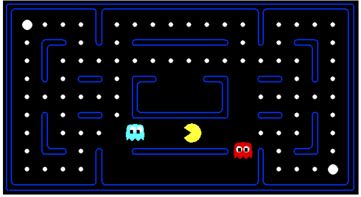

## 프로젝트 개요

* **프로젝트명:** Berkeley 인공지능 pacman 시뮬레이션
* **제작기간:** 약 2달 
* **플랫폼:** PC
* **언어:** Python
* **장르:** pacman
* **사용 프로그램:** Anaconda python

## 프로젝트 설명 

pacman 게임 환경에서 길 찾기 알고리즘을 사용하여 시뮬레이션 진행

동영상 시연 영상: 동영상 길이가 길어 편집 작업 중

## 구현기능
- BFS
- DFS
- A star
- Uniform cost
- enemy AI

## 아쉬운점 및 한계점
